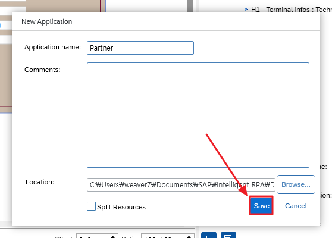
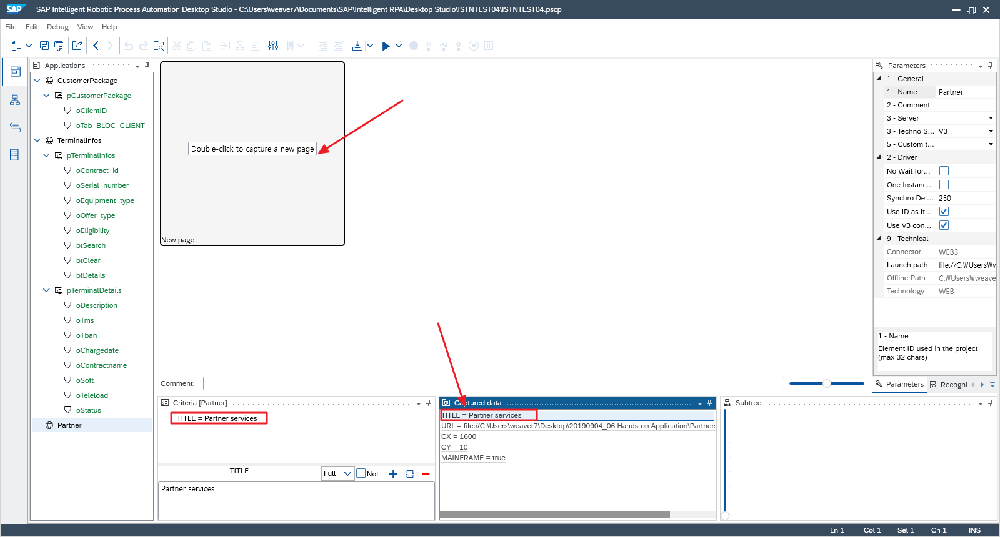

# **Deprecate**
~~# IRPA 런타임 환경 (Desktop Agent) 설정~~ 

~~## 1. IRPA Factory 에 컴퓨터 연결~~

~~## Tip. 다른 SCP 계정으로 로그인 해야하는 경우~~

~~## Tip. 다른 iRPA Factory을 사용해야하는 경우~~

**경로 : `C:\ProgramData\SAP\Intelligent RPA\tenants`**

~~## Tip. 다른 iRPA Factory을 사용해야하는 경우~~

