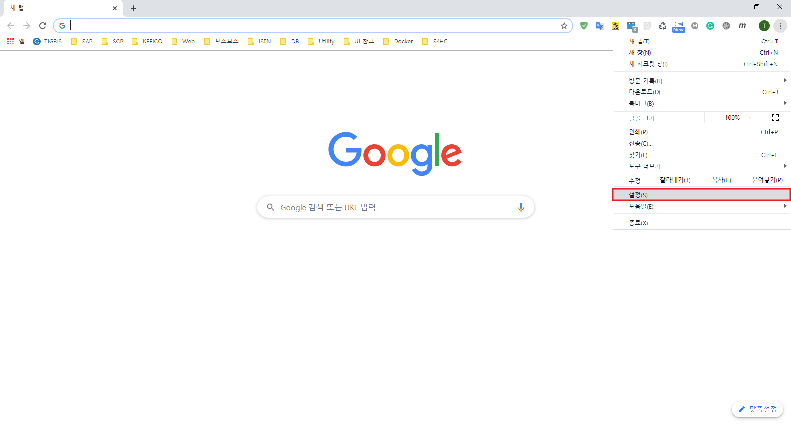
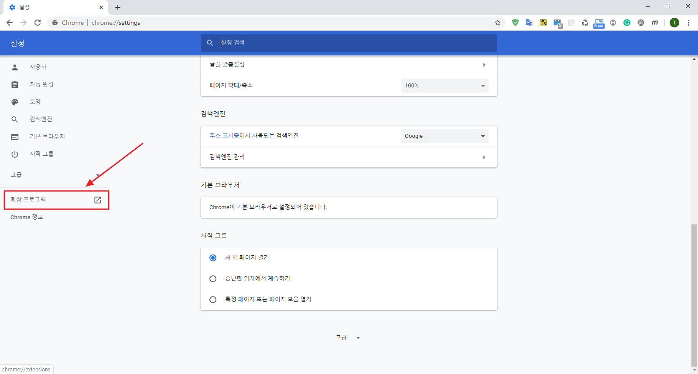
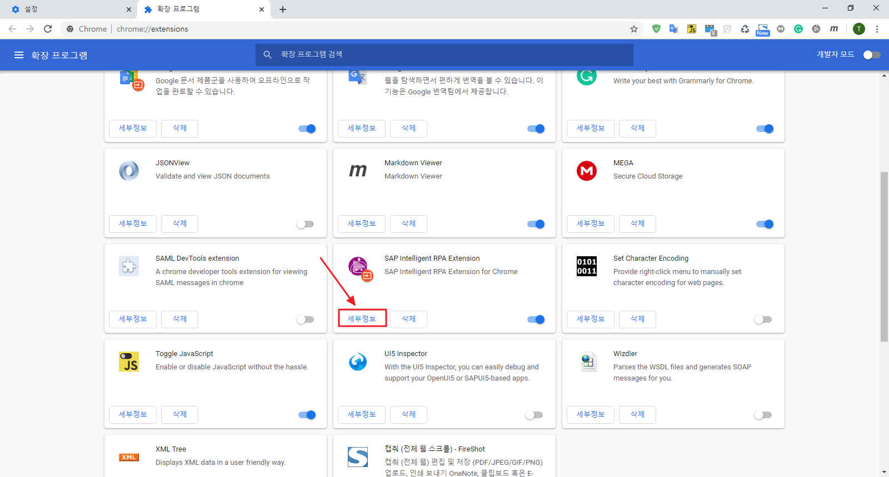
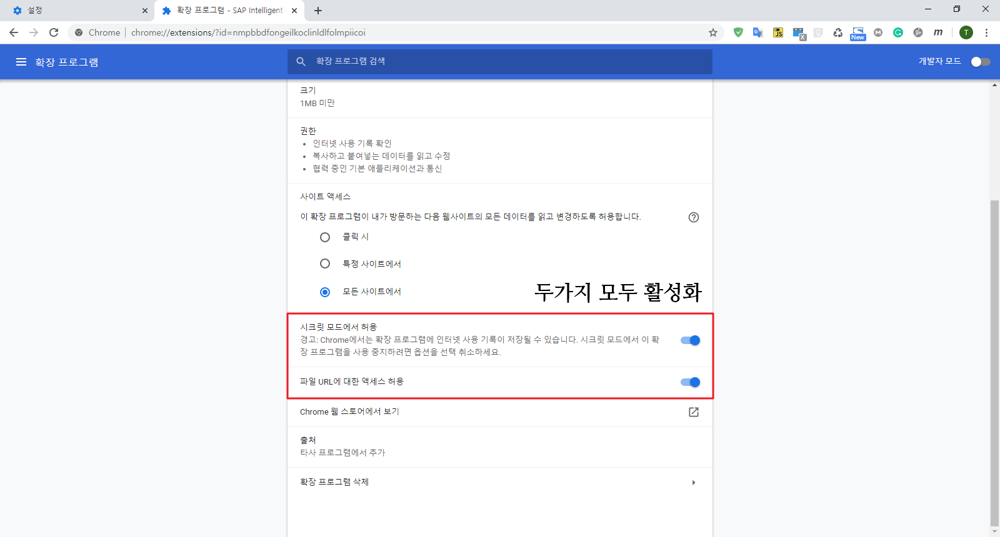
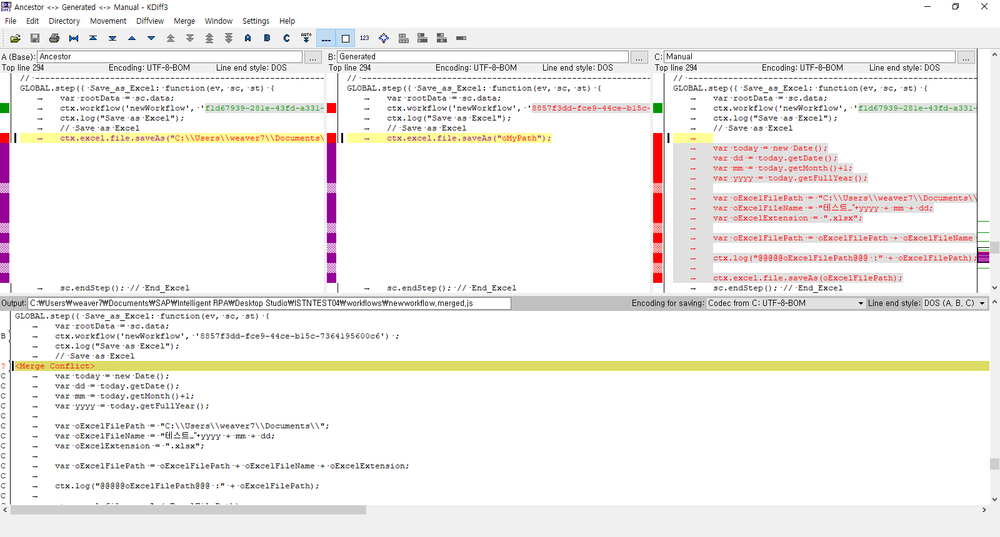
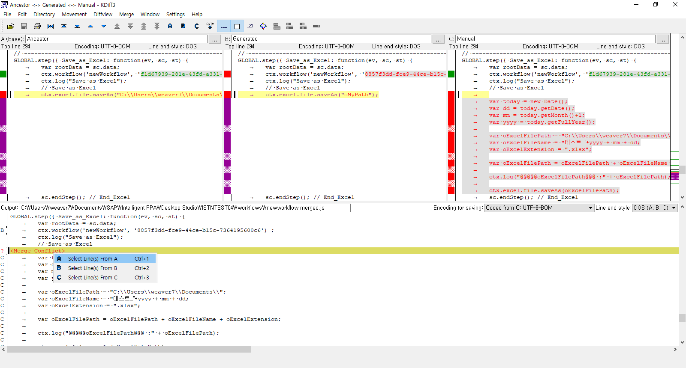
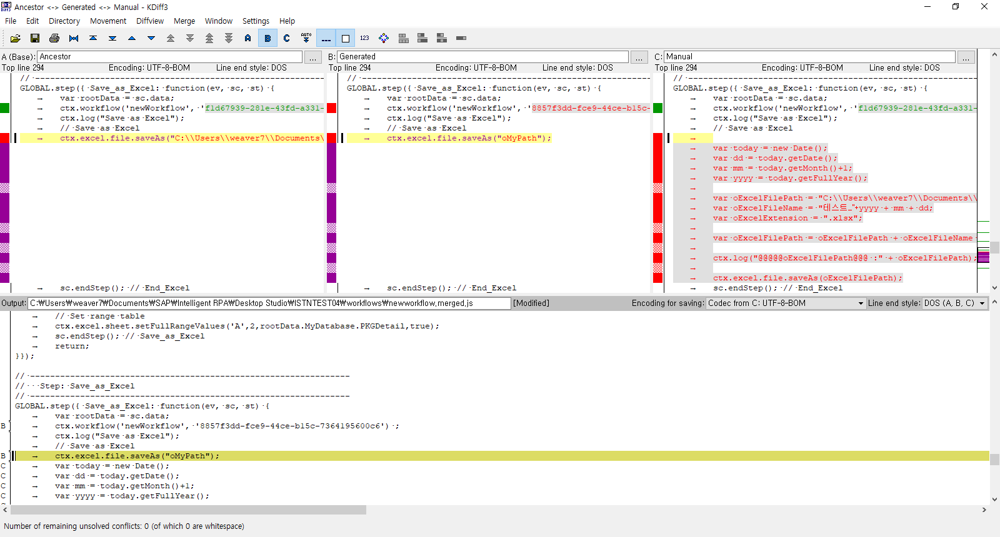

# 자주 묻는 질문

## 1. Desktop Agent 실행 안될 때

>Desktop Studio 가 안 뜨거나 , 봇 실행이 안되는 경우 작업관리자에서 해당 서비스를 종료 후 재시작

## 2. Desktop Agent 재 로그인 하는 법

## 3. Browser를 Desktop Studio가 인식 못하는 경우 (Chrome)

## 4. KDiff3

