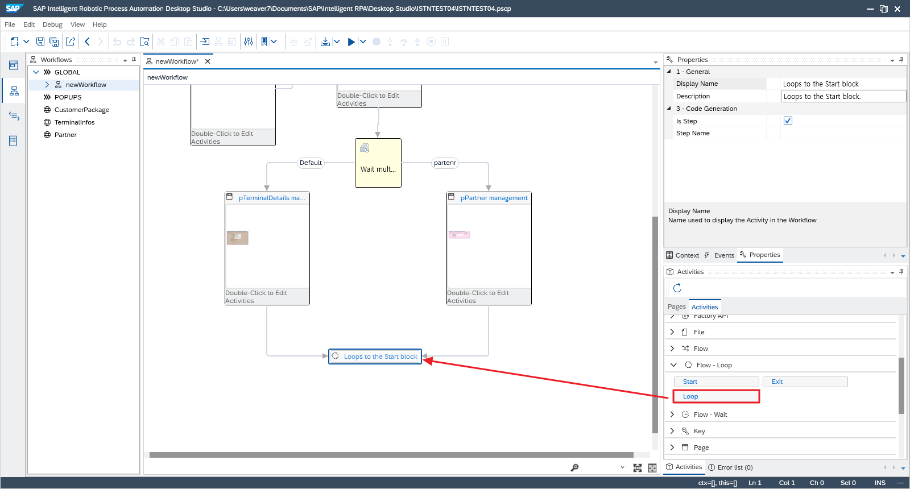
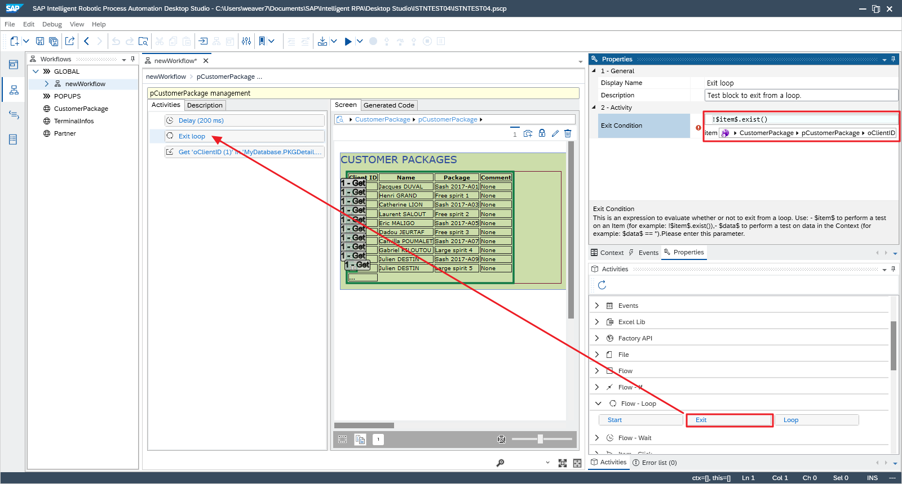
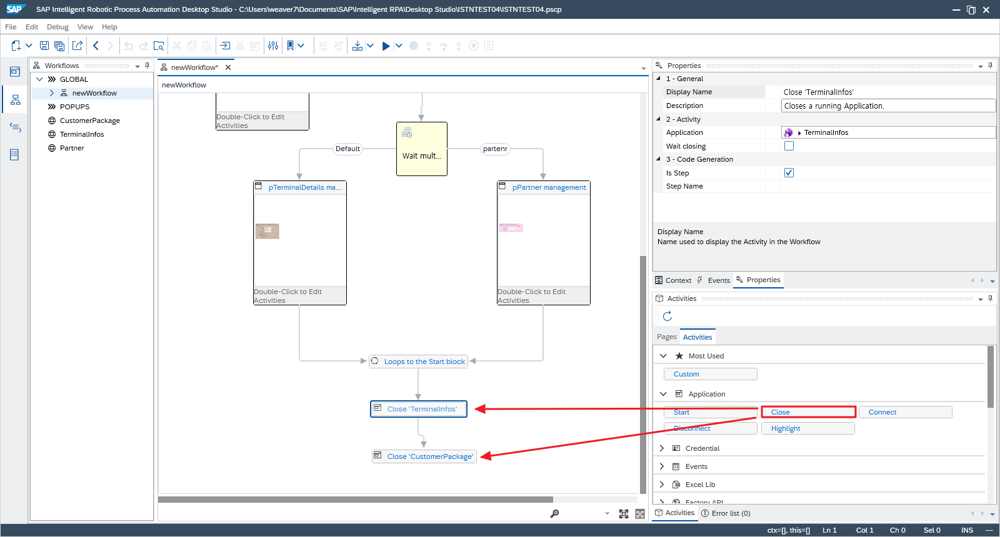
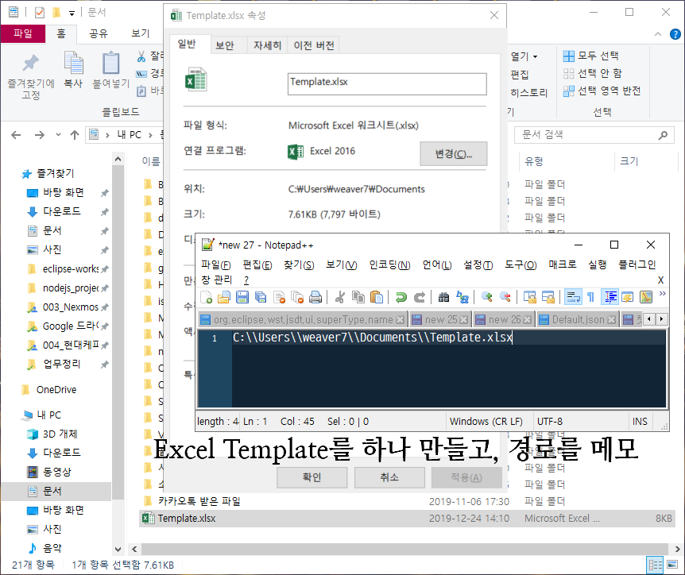
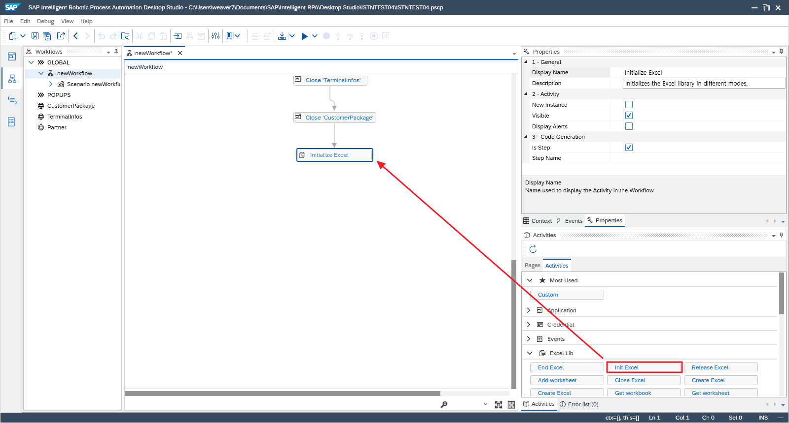
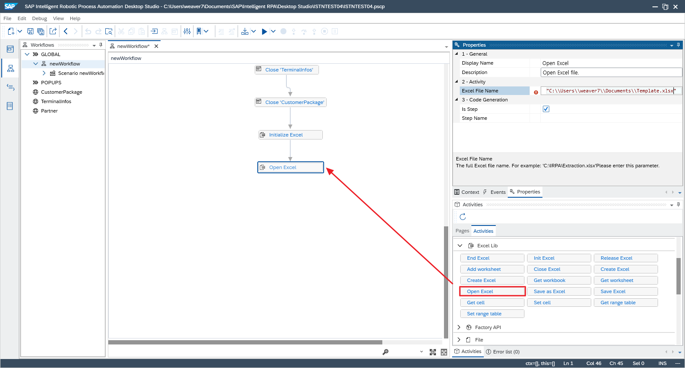
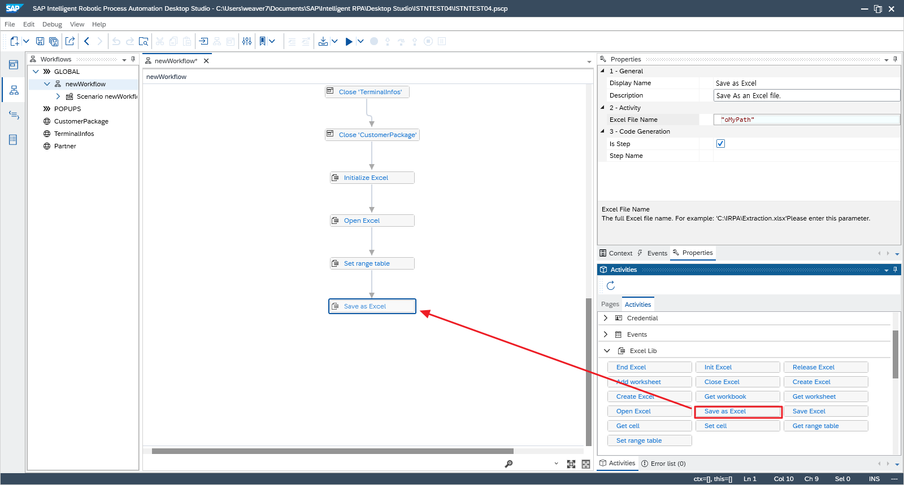
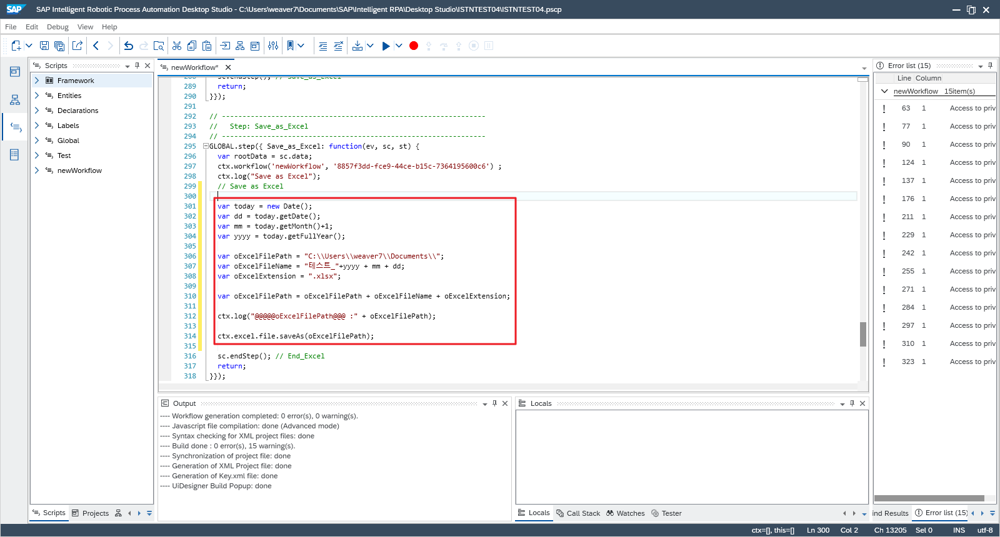
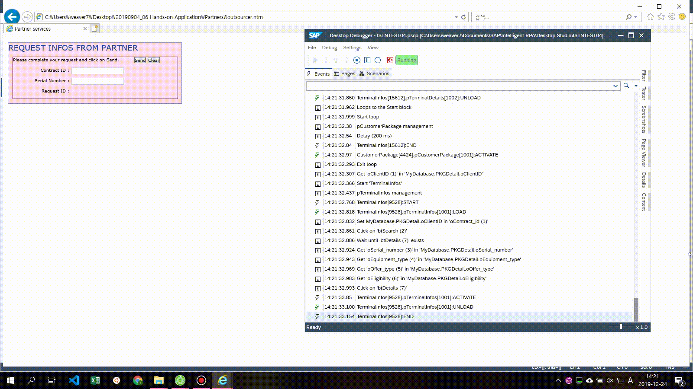

# iRPA Excercise 03

## 반복(Loop) 실행 Workflow







# 반복(Loop) 실행결과


# Excel Export
















```javascript
    var today = new Date();
	var dd = today.getDate();
	var mm = today.getMonth()+1;
	var yyyy = today.getFullYear();
	
	var oExcelFilePath = "C:\\Users\\weaver7\\Documents\\";
	var oExcelFileName = "테스트_"+yyyy + mm + dd;
	var oExcelExtension = ".xlsx";
	
	var oExcelFilePath = oExcelFilePath + oExcelFileName + oExcelExtension;
	
	ctx.log("@@@@@oExcelFilePath@@@ :" + oExcelFilePath);
	
	ctx.excel.file.saveAs(oExcelFilePath);
```

# 실행결과



