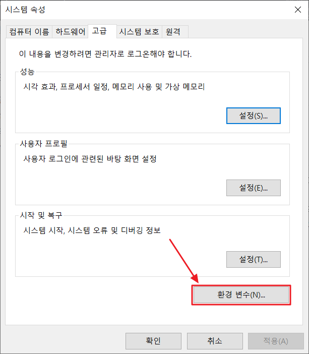
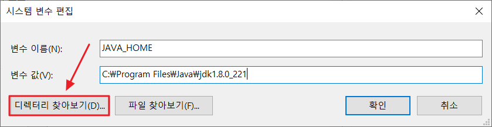
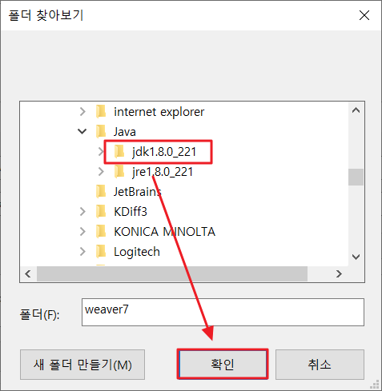
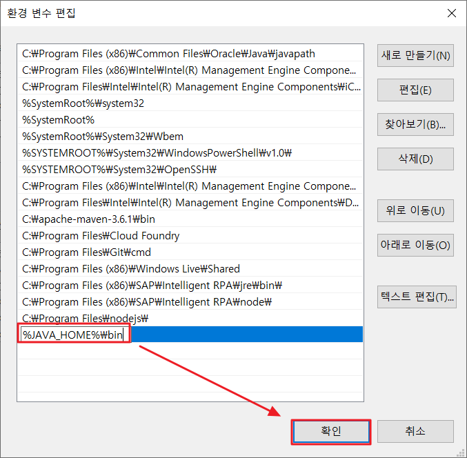
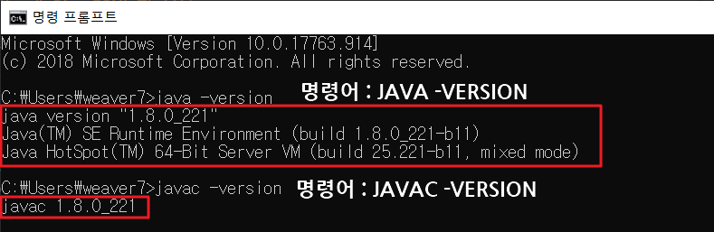
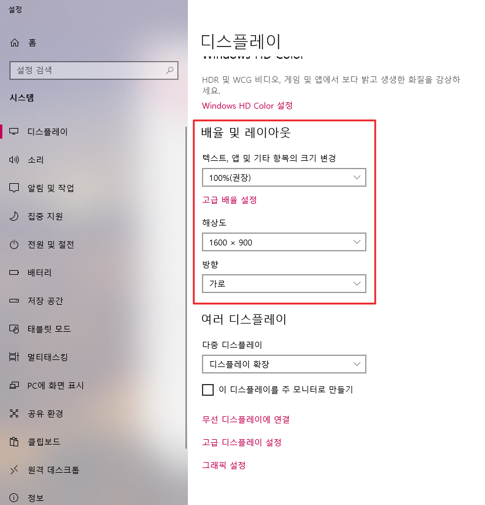
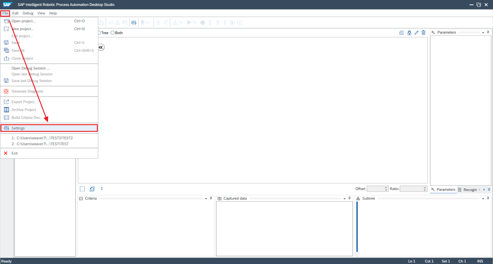
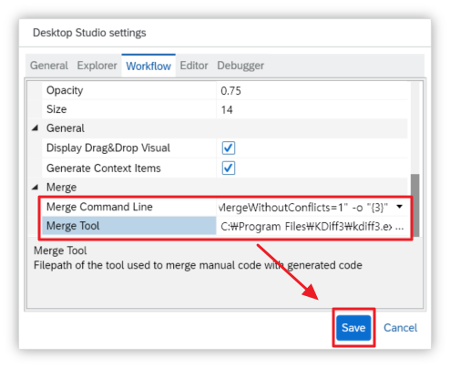
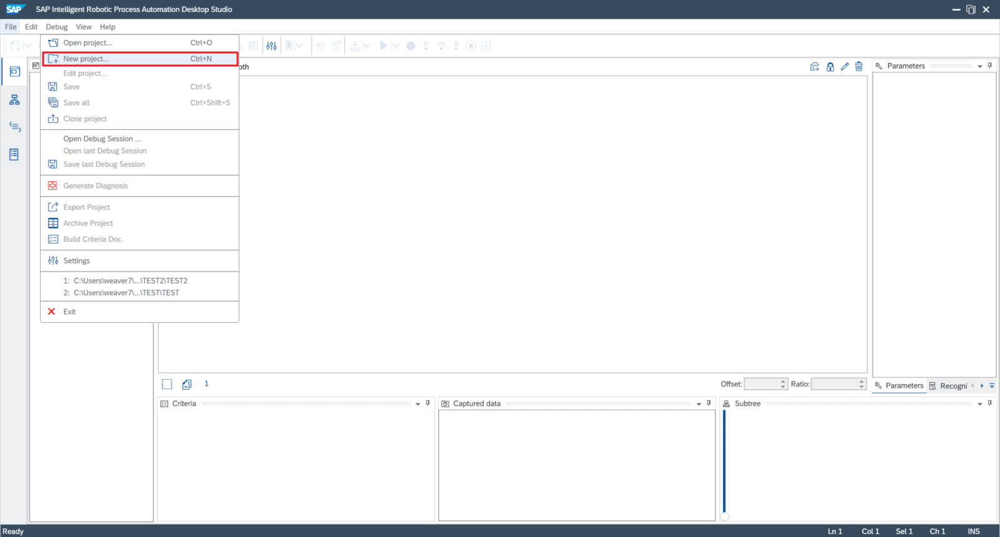
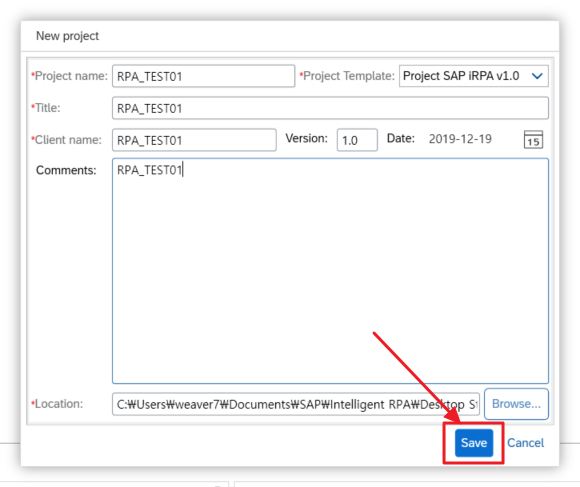

# iRPA_Hands_On

iRPA_Hands_On

# 목차
[1. SAP Intelligent RPA란?](#1.-sap-intelligent-rpa란?)

[2. SAP Intelligent RPA : 사용 사례](#2.-sap-intelligent-rpa-:-사용-사례)

[3. SAP Intelligent RPA : 개발 가능](#3.-sap-intelligent-rpa-:-개발-가능)

[4. RPA는 어떻게 비즈니스 가치를 창출할 수 있는가?](#4.-rpa는-어떻게-비즈니스-가치를-창출할-수-있는가?)

[5. SAP Intelligent RPA 적용 과정](#5.-sap-intelligent-rpa-적용-과정)

---

## 1. SAP Intelligent RPA란?

> SAP Intelligent Robotic Process Automation (RPA)는 부가 가치가 없는 지루한 작업을 자동화하여 비즈니스 프로세스의 디지털 전환을 가속화합니다.

RPA는 SAP 컨설턴트 또는 "전문가"가 선택한 "프로세스"에서 특정 반복 작업을 수행하기 위해 설계 및 생성한 `Bot`으로 구성됩니다. `Bot`은 `Attended Bots`로 분류된 사용자에게 `Digital Assistant`로 작동 할 수 있습니다. `Bot`은 또한 `Unattended`에서 작동 할 수 있습니다. Back-End 에서 특정 작업을 수행합니다. 이 `Bot`은 감독자 콘솔에서 `Orchastration` 및 모니터링 할 수 있습니다.

+ ### Unattended
	+ 로봇이 인간의 감독만으로 자율적으로 작업하는 완전 자동화된 프로세스

+ ### Attended
	+ 로봇이 인간과 공동 작업하는 부분 자동화 프로세스(Robotic Desktop Automation (RDA))
  
SAP Intelligent RPA는 단일 통합 클라우드 기반 솔루션입니다. "On-Premise" 자동화 도구도 포함되어 있습니다. 이것은 단계를 자동화하는 End-to-End 솔루션입니다. 우리 대부분은 “매크로 및 VBA 스크립트”에 익숙하여 Excel과 같은 Microsoft(MS) Application의 특정 작업을 자동화합니다. 그러나 단일 Application 내에서만 작동하고 다른 Non-MS Application에서는 작동하지 않습니다. SAP Digital Systems, Ariba, Concur 등과 같은 SAP의 솔루션뿐만 아니라 Non SAP System 및 legacy Application과 함께 사용할 수 있습니다. 또한 RPA는 `Bot`을 구축하기 위해 프로그래밍 기술이 필요하지 않습니다.

## SAP Intelligent RPA에는 다음과 같은 세 가지 Component가 있습니다.

**1. Desktop Agent**

**2. Cloud Factory**

**3. Desktop Studio**

## 1)Desktop Agent

이 Component는 Cloud 관리자가 End-User의 컴퓨터에 설치합니다. 설치되면 시스템의 Agent가 관리자 권한을 요구하지 않습니다. Agent는 작업에 사용자 프로필과 Windows Credential을 채택합니다. Desktop Agent는 Javascript Framework입니다. SAP, Webpage, Custom Applications 등과 같은 응용 프로그램과 상호 작용할 수 있는 다양한 드라이버 세트가 있습니다. Agent는 API, File System 및 Database API에 연결하여 작업을 수행하고 결과를 얻을 수 있습니다. `Conversational AI` 및 `Leonardo Machine Learning` 과 같은 SAP Intelligent 서비스에 연결할 수도 있습니다.

사용자 화면의 데이터 클릭, 탐색 및 조작과 같은 작업은 모두 Desktop Agent에 의해 수행됩니다. Desktop Framework는 화면에서 비즈니스 응용 프로그램 상단에 오버레이 "사용자 인터페이스"를 만들 수 있도록합니다. 이는 특정 단계를 수행하고 데이터를 수집하여 사용자에게 최종 "Go / No Go"답변을 제공 할 때 도움이됩니다.버튼이나 레이블과 같은 UI 요소를 코드를 수정하지 않고 비즈니스 응용 프로그램 위에 추가할 수 있습니다. Agent 보안은 Cloud Factory에 등록할 때 설정됩니다. Desktop과 Cloud Factory는 안전한 WebSocket을 사용하여 지속적으로 연결되며 Cloud Factory에서 필요한 인증을 제공합니다.

## 2)Cloud Factory

Cloud Factory는 모든 프로세스 자동화를 오케스트레이션하는 전용 Bot Management Central Component입니다. 그것은 조경에서 작업과 에이전트를 모니터링하고 제어하며 대시보드 형태로 표시합니다. 계층, 환경, 패키지 및 "구성"이라는 세 가지 하위 구성 요소로 구성됩니다.

`Bot`을 실행할 책임이 있는 구조화된 머신 및 에이전트 세트는 "계층 구조"에 정의되어 있습니다. 봇이 "유인"또는 "무인"모드로 실행되도록 시간창을 할당하고 "시간창을 할당"할 수 있습니다. 노드 또는 Agent별로 수행할 수 있습니다. 이를 통해 조직의 작업 부하 분산에 따라 특정 봇이 야간 또는 피크가 아닌 시간에 실행되도록 예약할 수 있습니다.

URL, 자격 증명, 변수 및 기타 정보와 같은 정보는 "환경"의 일부로 캡처됩니다. 일반적으로, 주어진 런타임에 특정한 많은 정보가 환경별로 그룹화됩니다. 환경은 또한 SAP 권장 “DEV” 또는 “TEST” 또는 “PROD” 유형 중 하나에 바인딩됩니다. 이는 DEV 환경에서 봇을 개발하고 테스트 환경에서 테스트를 수행하고 "PROD"환경에 배포하는 데 도움이됩니다. 필요에 따라 여러 환경을 만들 수 있습니다. “환경”은“계층 구조”에 묶여 있습니다. 이를 통해 계층 구조가 링크 된 환경에서 런타임 정보를 파생시킬 수 있습니다.

## 3)Desktop Studio

# 2. SAP Intelligent RPA : 사용 사례

+ ## 데이터 수집

	+ Excel, 공급 업체 포털, SAP 시스템과 같은 여러 데이터 소스의 데이터 통합 및 조작

	+ 프로세스 실행 중 사용자가 터치한 여러 애플리케이션 
	(예 : Excel, outlook, Web application, S/4HANA, ECC, non-SAP systems) 
    
+ ## 협업, 사용자 행동 트리거 및 커뮤니케이션

	+ 여러 이해 관계자와의 승인 / 추적
  
    + Workflow 트리거
    + 자동 서비스 티켓 해결
    + 월간 보고서
    + 메일 통합 

+ ## 사용자 생산성 향상

	+ 디지털 어시스턴트로 프로세스를 가속화하고 개선할 수 있습니다. 예를 들어 챗봇과 RPA봇을 통합하여 사용자 대신 운영 작업을 수행합니다.
  
    + 프로세스의 일부는 봇에 의해 완전히 실행됩니다 (예 : 연중무휴 24시간 실행) 

# 3. SAP Intelligent RPA : 개발 가능

+ ## 공유 서비스 자동화

	+ 수동 작업을 자동화하여 더 빠르게 실행하고 오류를 줄이며 프로세스 및 리소스를 최적화합니다

    	+ 결제 어드바이스 관리
        + 재무 결산 작업리스트 자동화
        + 은행 계좌 명세서 관리
        + 클레임 처리 

+ ## 재무 변환

	+ 빠른 재무 마감, 수동 작업 감소 및 리소스 최적화

    	+ 재무 결산
        + G/L 할당
        + 현금 운영 자동화
        + 자산 회계 운영
        + FSI와 은행 통합 

+ ## 고객 서비스 자동화

	+ 고객 만족도 및 처리량 향상

    	+ 고객 온 보딩
        + 반품 작업
        + 판매 견적, 주문처리 및 데이터 입력
        + 작업 지시 자동화 및 변경 요청
        + 하청 계약 채우기 형태
		+ 회사 간 SO 처리 

+ ## 운영 자동화

	+ 수동 작업 자동화, 모니터링 및 가시성

    	+ 구매 주문 자동화
        + 공급 업체 분류 및 분할
        + 마스터 데이터 관리
        + IT 서비스 티켓 할당 및 해결 
  
+ ## 자료 관리
	+ 직원 및 고객을위한 빠른 온보딩, 일관된 마스터 데이터

    	+ 데이터 마이그레이션 및 입력
        + 신입 사원 온 보딩
        + 계약 데이터 유지 보수

# 4. RPA는 어떻게 비즈니스 가치를 창출할 수 있는가?

+ ### 운영 개선

	+ 저렴한 비용으로 고 부가가치 업무를위한 자원 동원

+ ### 서비스 품질 향상

	+ 수익 창출 트랜잭션의주기 시간 단축

+ ### 규정 준수 향상

	+ 및 분석 기능 (예 : 잘 문서화 된 감사 추적을 통해)

+ ### 인적 오류 감소
	+ 속도와 효율성을 얻습니다

# 5. SAP Intelligent RPA 적용 과정

1. 개발자는 `Desktop Studio` 를 사용하여 애플리케이션을 캡처하여 자동화 시나리오를 빌드

2. 시나리오가 포함된 패키지를 `Desktop Studio` 에서 Export

3. 관리자는 패키지를 Cloud Factory로 Import하고 `Bot` 유형 , 스케줄링 등을 구성

4. Cloud Factory 는 사용 가능한 Desktop Agent 로 Application을 자동화하기 위한 시나리오를 Push

5. 관리자는 시나리오의 성능을 모니터링

# 6. SAP iRPA Componet Setting

1. Desktop Studio(iRPA Bot Dev Tool on-premise)
   1. 설치 파일
      + INT_RPA_AGENT00P_5-80004525.MSI
      + jdk-8u221-windows-x64.exe

        + **시스템 -> 고급 시스템 설정**
        
        

        + **환경변수 설정**
        
        

        + **시스템 변수 편집1**
        
        

        + **시스템 변수 편집2**

        

        + **시스템 변수 편집3**

        

        **설치된 JDK 경로 : `C:\Program Files\Java\jdk1.8.0_221`**

        + **시스템 변수 편집4**

        

        + **시스템 변수 Path 편집1**

        

        + **시스템 변수 Path 편집2**

        

        **`%JAVA_HOME%\bin`** 입력후 저장

        + **JDK 버전 확인**

        

        **`java -version`**

        **`javac -version`**

        버전이 정상적으로 출력되는지 확인

      + KDiff3-64bit-Setup_0.9.98-2.exe

      + NDP472-KB4054531-Web.exe

      + node-v10.15.3-x64.msi

        

        **`node -v`**

      + vs_remotetools.exe

   2. 해상도 설정

        

   3. KDiff3 설정

        + Desktop Studio 프로그램 실행

        

        + File -> Settings

        
        
        
        

        + File -> New Project
        
        
        

        + File -> Edit Project
        
        
        

2. IRPA Factory(iRPA Bot Management Tool cloud)

3. Desktop Agent(iRPA Bot Runtime on-premise)

[SAP Best Practices for SAP Intelligent Robotic Process Automation integration with SAP S/4HANA ](https://rapid.sap.com/bp/#/browse/categories/sap_s%254hana/areas/automation/packageversions/IRPA_S4HANA)

[SAP Best Practices - Content Library](https://support.sap.com/content/dam/SAAP/Sol_Pack/IRPA_S4HANA/IRPA_S4HANA_IPA10_07_Content_Library_EN_XX.htm)

[iRPA Support](https://launchpad.support.sap.com/#/solutions/notesv2/?q=sap%252520intelligent%252520Robotic&sortBy=score&sortOrder=desc)

 - [x] TEST